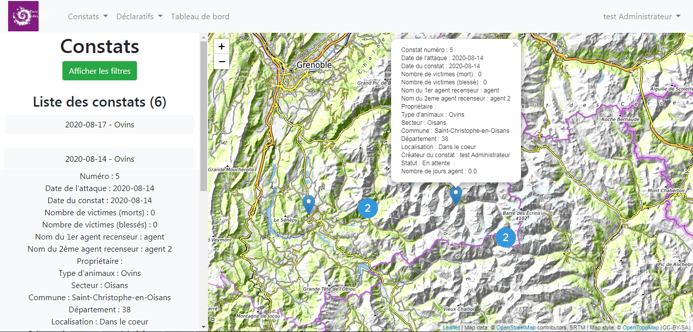

# GeoConstats

Application web permettant d'inventorier les constats de prédation d'un territoire.



- Base de données : PostgreSQL / PostGIS
- Langage : Python
- Framework Python : Flask
- CSS : Bootstrap
- Javascript : Jquery + Leaflet

# Installation

## 1. Installation de l'application

- Lancer le script `install_env.py`
- Lancer le script `install_app.py`

Le script `install_app` installe les dépendances python et crée un service systemd qui se charge du lancement de l'application. Le nom du service est `geoconstat`.

Pour stopper l'application : `sudo systemctl stop geoconstat`
Pour redémarrer après un changement de configuration l'application : `sudo systemctl stop geoconstat`
Les logs se situent dans le fichier `/var/log/geoconstat.log`

## 2. Préparation de la base de données

- Copier le fichier `settings.ini.sample` et le nommer `settings.ini` avec la ligne de commande `cp settings.ini.sample settings.ini`
- Editer le fichier `settings.ini` avec les informations de la base de données avec la ligne de commande `nano settings.ini`. Une fois les informations saisies, enregistrer le fichier en appuyant sur ctrl + o puis entrer puis crtl + x.
- Dans le terminal, exécuter la ligne de commande `./install_db.sh`.
  Une fois la base installé, l'application doit tourner à l'adresse 127.0.0.1/<PORT_SETTING.INI>
- Une fois le script passé, lancez `sudo systemctl start geoconstat`

## 3. Configuration Apache

- Créer un nouveau site : `sudo nano /etc/apache2/sites-available/geoconstats.conf`
- Coller la configuration suivante :

```
<Location /geoconstats >
   ProxyPass http://127.0.0.1:5000
   ProxyPassReverse http://127.0.0.1:5000
</Location>
```

```
<Location / >
   ProxyPass http://127.0.0.1:5000/
   ProxyPassReverse http://127.0.0.1:5000/
   RequestHeader set X-Forwarded-Proto "https"
</Location>
```

```
sudo a2enmod headers
```

En https

- Lancer les commandes suivantes :

```
  sudo a2enmod proxy
  sudo a2enmod proxy_http
  sudo a2ensite geoconstat
```

## 6. Lancement en mode dev

- De retour dans la console dans le dossier GeoConstats, activer le virtualenv avec la ligne de commande `source env/bin/activate`
- A ce moment, on rentre dans l'environnement de travail.
- Ensuite, on lance l'application avec la ligne de commande : `python3 run.py`.
- Dans un navigateur web, rentrer l'url http://127.0.0.1:5000/ pour accéder à l'application.

**Auteur** : Raphaël Bres / Juillet 2020

Inspiré de l'application Flask-leaflet-example (https://github.com/PnEcrins/Flask-leaflet-example)
